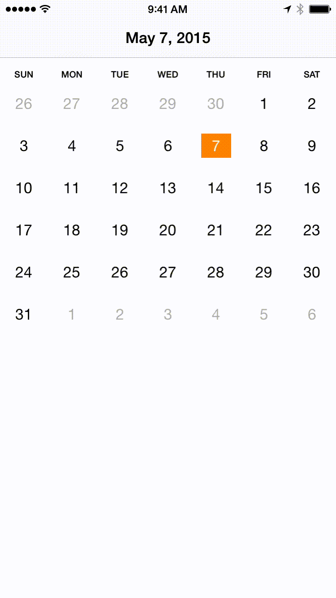
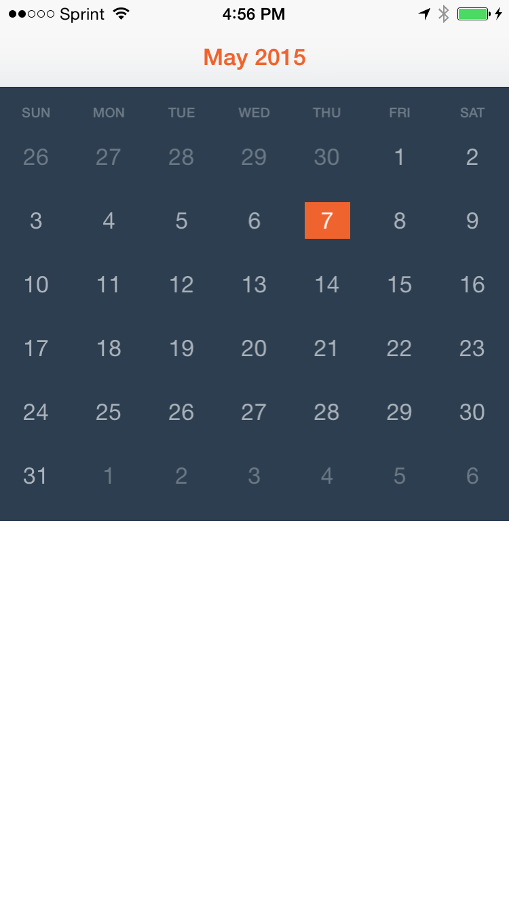

# CalendarView

[](https://travis-ci.org/Nate Armstrong/CalendarView)
[](http://cocoapods.org/pods/CalendarView)
[](http://cocoapods.org/pods/CalendarView)
[](http://cocoapods.org/pods/CalendarView)

## Usage

To run the example project, clone the repo, and run `pod install` from the CalendarViewDemo directory first.

## Requirements

* iOS 8.3+
* Xcode 6.3

## Installation

CalendarView is available through [Carthage](https://github.com/Carthage/Carthage) and [CocoaPods](http://cocoapods.org).
To install it, simply add the following line to your Podfile:

```ruby
pod "CalendarView"
```

## Screenshot


&nbsp;
&nbsp;


## Usage

Use the `CalendarView` class in code:

```swift
let calendar = CalendarView(frame: CGRectMake(0, 0, CGRectGetWidth(view.frame), 320))
view.addSubview(calendar)
```

or as an outlet (supports auto layout)

```swift
@IBOutlet weak var calendar: CalendarView!
```

### Select specific date

The selected date is the current date by default. You can select any date by using
the `selectDate(date: Moment)` method.

```swift
let date: NSDate = MY_NSDATE
calendar.selectDate(moment(date))
```

### Delegate

A `CalendarView`'s `delegate` is notified of two events:

```swift
calendarDidSelectDate(date: Moment) // called when user taps a date
calendarDidPageToDate(date: Moment) // called when users swipes month
```

The `CalendarView` class uses [SwiftMoment](https://github.com/akosma/SwiftMoment)
for date manipulation.

#### Example use of delegate calls

```swift
extension ViewController: CalendarViewDelegate {

  func calendarDidSelectDate(date: Moment) {
    title = date.format(dateFormat: "MMMM d, yyyy")
  }

  func calendarDidPageToDate(date: Moment) {
    title = date.format(dateFormat: "MMMM d, yyyy")
  }

}
```

### Customizations

The aim is to allow the calendar to be as customizable as possible without making
it overly complex and bloated.

#### Appearance

You can customize the look of the calendar by setting certain class properties of
`CalendarView`.

```swift
import UIKit
import CalendarView

@UIApplicationMain
class AppDelegate: UIResponder, UIApplicationDelegate {

  var window: UIWindow?


  func application(application: UIApplication, didFinishLaunchingWithOptions launchOptions: [NSObject: AnyObject]?) -> Bool {
    // Calendar appearance
    CalendarView.daySelectedBackgroundColor = UIColor.secondaryColor()
    CalendarView.daySelectedTextColor = UIColor.whiteColor()
    CalendarView.todayBackgroundColor = UIColor(white: 0.0, alpha: 0.3)
    CalendarView.todayTextColor = UIColor.whiteColor()
    CalendarView.otherMonthBackgroundColor = UIColor.clearColor()
    CalendarView.otherMonthTextColor = UIColor(white: 1.0, alpha: 0.3)
    CalendarView.dayTextColor = UIColor(white: 1.0, alpha: 0.6)
    CalendarView.dayBackgroundColor = UIColor.clearColor()
    CalendarView.weekLabelTextColor = UIColor(white: 1.0, alpha: 0.3)

    return true
  }
}
```

#### Selected date on swipe

By default the first day of the month is automatically selected when the user swipes
to a different month. You can customize this behavior by modifying the `selectedDayOnPaged`
property of your `CalendarView` instance:

```swift
public var selectedDayOnPaged: Int? = 1
```

If set to `nil`, no day will be automatically selected on swipe.

## Author

Nate Armstrong, natearmstrong2@gmail.com

## License

CalendarView is available under the MIT license. See the LICENSE file for more info.
